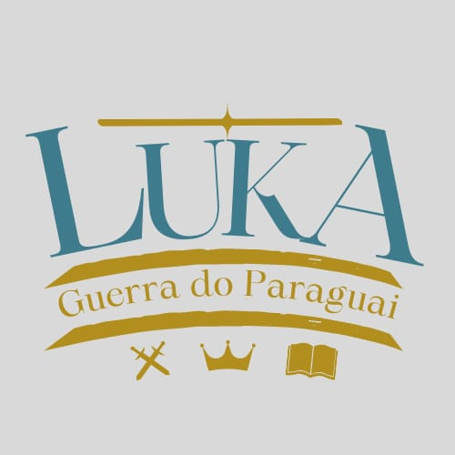

# Lukas-World

## **1. Identificação**

**A. Identidade Visual** 

  

**B. Redes sociais do projeto**

- Em andamento...

**C. Equipe**

 - Nome: Lucas Gabriel Kuligowski

 - E-mail: lucaskuligowski@gmail.com

 - Telefone: 41 99549-8633

_

 - Nome: Luana Quezia Fontes Rodrigues

 - E-mail: luu.quezia@gmail.com

 - Telefone: 41 98831-2770

**D. Data de criação do documento**

 - 14/06/2023

## **2. Introdução**

## **Resumo**

  A Guerra do Paraguai foi o maior conflito armado da história da América do Sul, começou em 1864 e acabou apenas em 1870. O conflito envolveu os países Paraguai, Argentina, Uruguai e Brasil, e começou quando tropas paraguaias aprisionaram a embarcação brasileira Marquês de Olinda, e invadiram o Mato Grosso, em 26 de dezembro de 1864. Esse ataque foi uma represália ao ataque brasileiro no Uruguai contra os blancos, que eram aliados de Solano Lopez. A guerra do Paraguai trouxe grandes consequências para a América do Sul, principalmente ao próprio Paraguai, que sofre até hoje em virtude dessa guerra. 😮

  Apesar da relevância desse conflito, devido à forma como a história é trabalhada nas escolas brasileiras, as questões relacionadas à América Latina acabam relegadas a segundo plano, iniciando os estudos sobre o tema apenas no ensino médio, junto com estudos sobre a Ásia e a África. O ensino de história no Brasil apresenta, majoritariamente, uma única cronologia fundamentada através de uma lógica formal positivista. Assim como aponta Simone Varela, no artigo “Trajetória do Ensino de História no Brasil”¹, todo o conteúdo histórico apresentado nas salas de aula é baseado em datas ‘fundamentais’ e ‘heróis’ históricos portugueses em seu processo de chegada ao Brasil, deixando de lado, muitas vezes, as etnias que aqui existiam, sua cultura, e aspectos históricos próprios. Sendo assim, o conteúdo histórico abordado em sala de aula se torna focado apenas em uma única perspectiva. 👀

  Segundo Paulo Freire, a educação no Brasil é uma educação bancária. O termo surgiu em seu livro Pedagogia do Oprimido, e representa a metodologia de ensino baseado no “ato de depositar, em que os educandos são os depositários e os educadores são os depositantes”. Sendo assim, uma educação que valoriza mais a transmissão de conhecimento do que a retenção ou compreensão do mesmo. Isso ocorre principalmente através de aulas tradicionais, pouco atrativas e com pouco espaço para reflexões por parte dos alunos. Através disso, Paulo Freire propôs a “educação libertadora”, que visa oferecer espaço para uma participação ativa do aluno no processo ensino aprendizagem, além de incentivar a reflexão por conta e melhorar a compreensão histórica. ✏️📚

  Cada vez mais os jogos acadêmicos são incluídos no método de ensino e aprendizagem, visando uma melhor compreensão e desenvolvimento dos alunos em diversas áreas cognitivas e sociais. Assim como apresentado no artigo de Fernandes (2010), os jogos educacionais despertam muito mais interesse no conteúdo por parte dos alunos do que apenas uma abordagem tradicional em sala de aula. Além disso, os jogos proporcionam autonomia aos estudantes que, através de sua própria dedicação, completam desafios e evoluem em cada fase. 🎮🧠

  Assim como uma aula de história, um jogo deve ser preparado seguindo alguns critérios, dentre eles: qual conteúdo e temática será abordado no jogo, quais competências serão contempladas, como os alunos serão avaliados e qual será a contribuição do jogo como material didático-pedagógico. Dessa forma, o objetivo deste trabalho é desenvolver um jogo educativo sobre a Guerra do Paraguai, para alunos do ensino médio, podendo ser usado durante a aula para auxiliar o professor no ensino, a fim de obter um aprendizado mais imersivo e direto, através da participação ativa do aluno experienciando o momento histórico. 🎲📖📚
  
  **A. Objetivo do projeto**

  O presente artigo apresenta o jogo Luka's World, um jogo focado na contextualização histórica da Guerra do Paraguai, apresentando o processo de criação, pesquisa, desenvolvimento e finalização do jogo. A temática do jogo foi escolhida para ser um jogo capaz de ser apresentado em salas de aula, como material didático, ou ainda, capaz de jogar individualmente como material educativo. O problema motivador para tal escolha é O trabalho visa responder às perguntas: "como ensinar história de forma interativa" e "como abordar temas pouco explorados no âmbito escolar". 🎮📚

  Fazem parte da pesquisa, mapas mentais sobre a escolha do tema, diagramas de atividades do jogo, estudo da game engine Godot, estudo da plataforma piskel, desenvolvimento do design e pesquisas históricas sobre os principais acontecimentos da guerra. 📝🎨🔍

**B. Escopo do projeto**

  O minimo produto viavel do jogo será uma versão inicial funcional que terá algumas funcionalidades:
 - Terá a primeira fase do jogo completa
 - Recursos basicos do jogador concluido
 - Sistema de salvamento local
 - trilha sonora
 - Menu inicial e menu de pause

Este jogo é projetado para ser divertido 🎮 e envolvente, mas também educativo 📚, oferecendo aos jogadores uma maneira única de aprender sobre a história da Guerra do Paraguai. Ele busca envolver os jogadores com uma narrativa envolvente 📖, gráficos pixel art 🎨 de alta qualidade e uma mecânica de jogo que promove a exploração e a descoberta 🔎.

Desenvolvido para PC 💻, "Através da História: Guerra do Paraguai" é um projeto que tem a intenção de destacar a importância do passado ⏳ na formação do presente, e o poder dos videogames como uma ferramenta para a educação e o entendimento histórico 🧠. Nós esperamos que os jogadores sejam imersos na história, desafiados pelas missões do jogo 🎯 e, acima de tudo, se divirtam 😄 ao explorar o fascinante mundo que criamos 🌎.

## **3. Matriz de riscos**

| Risco | Probabilidade | Impacto | Estratégia de Mitigação |
|-------|---------------|---------|-------------------------|
| Desenvolvimento atrasado | Médio | Alto | Ter um cronograma de desenvolvimento bem definido e monitorar o progresso regularmente. |
| Orçamento insuficiente | Médio | Alto | Fazer um orçamento cuidadoso, incluindo uma reserva para imprevistos. |
| Falta de engajamento dos jogadores | Alto | Alto | Realizar pesquisas de mercado e testes de jogabilidade para ajustar o jogo às preferências do público-alvo. |
| Falha em manter a precisão histórica | Baixo | Médio | Fazer uma pesquisa histórica detalhada e ter consultores históricos se possível. |
| Problemas técnicos (bugs, crashes) | Alto | Alto | Implementar testes rigorosos de controle de qualidade e corrigir bugs rapidamente. |
| Mau desempenho em algumas plataformas | Médio | Médio | Testar o jogo em diversas plataformas e otimizar o desempenho. |
| Concorrência de outros jogos similares | Médio | Médio | Diferenciar o jogo por meio de recursos únicos e promoção eficaz. |
| Recepção negativa da imprensa/críticos | Baixo | Alto | Ter uma estratégia de relações públicas e marketing sólida, garantir a qualidade do jogo antes do lançamento. |
| Problemas legais (uso indevido de propriedade intelectual, etc.) | Baixo | Alto | Fazer uma verificação legal prévia para garantir que todas as propriedades intelectuais estão sendo usadas de maneira adequada. |

## **4. Organização do projeto**

Link para o Trello: https://trello.com/b/N7oG8mnk/lukas-world

## **5. Conclusão**

**A. Recursos e ferramentas**

| Ferramenta | Versão | Link                                            | Descrição de uso                                    |
|------------|--------|-------------------------------------------------|-----------------------------------------------------|
| Godot      | 3.5.1  | [Download](https://godotengine.org/download/windows/)     | Game engine, é o programa que facilita o desenvolvimento do jogo |
| Piskel     | 0.14.0 | [Download](https://www.piskelapp.com/download)       | Software de criação de sprites para o jogo           |
| GDScript   | 3.5.1  | [Download](https://godotengine.org/download/windows/)     | Linguagem de programação usada na Godot              |
